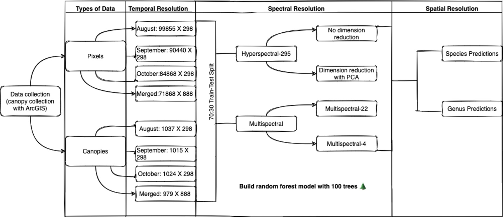

# Center for Advanced Land Management Information Technologies
## Tree Species Classification Using Hyperspectral Airborne Images With Random Forest Model 

## Data
Three hyperspectral airborne images of East Campus, University of Nebraska-Lincoln were collected in the summer 2018 (at 1:16 pm on August 02, 11:18 am on September 17 and on 12:52 pm on October 16) using an imaging spectrometer (AISA Kestrel, Specim, Oulu, Finland) mounted on a fixed-wing aircraft (Piper Saratoga, Vero Beach, Florida, USA) operated by the Center for Advanced Land Management Information Technologies (CALMIT) at the University of Nebraska – Lincoln. The Kestrel imaging spectrometer collects hyperspectral data with 2.4 nm full width half maximum (FWHM) at 1.75 nm spectral sampling intervals (356 bands in total) from 400 to 1000 nm. The lens focal length was 35.5 mm with a field of view (FOV) of 40°. Images were collected from approximately 2 km above ground level at a speed of 196 km/h and the ground pixel size (IFOV) was approximately 1.5 m. Lab-measured calibration coefficients were used to radiometrically convert digital numbers (DN) to at sensor radiance (Wm-2sr-1nm-1). A geometric correction was done utilizing the position and rotational attributes (heading or yaw, roll, and pitch) of the airplane collected by an inflight RT3000 GPS and inertial measurement unit (IMU) (Oxford Technical Solutions Limited, England). Both radiometric calibration and georeferencing were done using the CaliGeoPro software package (Specim, Oulu, Finland).
The at-sensor radiance data was used as the input for the MODTRAN 5 correction (Berk et al. 2008) to retrieve surface reflectance as the radiative transfer model (RTM) output. We used the ‘mid-latitude summer’ atmospheric profile and ‘urban’ aerosol extinction model to drive the MODTRAN model. We applied a modified dense dark vegetation method (Kaufman et al. 1997) to estimate the aerosol optical thickness (AOT) at 550 nm (Liu et al. 2019). The columnar water vapor (CWV) was retrieved based on the effective apparent reflectance ratio using band centered at 815 nm as water absoption band, and bands centered at 775 nm and 865 nm as reference bands, due to the low signal-noise-ratio beyong 900 nm (Liu et al. 2019). The AOT@550 and CWV retrieval algorithms were developed for hyperspectral data that only covered the visible and near-infrared wavelengths (Liu et al. 2019). The DIScrete Ordinate Radiative Transfer (DISORT) was used in the scattering calculation of the MODTRAN 5 code. Once the AOT and CWV were retrieved, the surface reflectance can be calculated based on the four-stream radiative transfer theory (Verhoef & Bach 2003, 2012, Jiménez-Muñoz et al. 2010), as detailed in (Verhoef & Bach 2003). The RTM derived surface reflectance were convoluted to the Kestrel spectral resolutions at each band based on Gaussian response functions.

## Models
Multiple models were built to predict either genus or species of a each pixel or canopy in a hyperspectral airborne image. Various spectral resolutions were considered, hyperspectral (295 bands), hyperspectral (30 principal components calcualted from 295 bands), multispectral (22 bands), and multispectral (4 bands). In addition, two different temporal resolution were considered. Models built using only one image were considered unitemporal (individual), and those built using a merged image, meaning merging hyperspectral airborne image taken at different periods, were considered as multitemporal. 

## Notes
- Due to large size of models saved as joblib objects, they are not included in this project. However, if you are interested to test one of our models, feel tree to reach out. 
- In the accuracy_assessment/ folder, you can find tables summarizing the performance of all traind and tested models
## Acronyms
- Hyper : hyperspectral (295 bands) 
- Multi22: multispectral (22 bands)
- Multi4 : multispectral (4 bands)
- ind    : individual hyperspectral image
- merged : multitempooral hyperspectral image 
- pc30   : 30 principal components for dimension reduction
- nd     : no dimension reduction performed

## Big thanks to:

